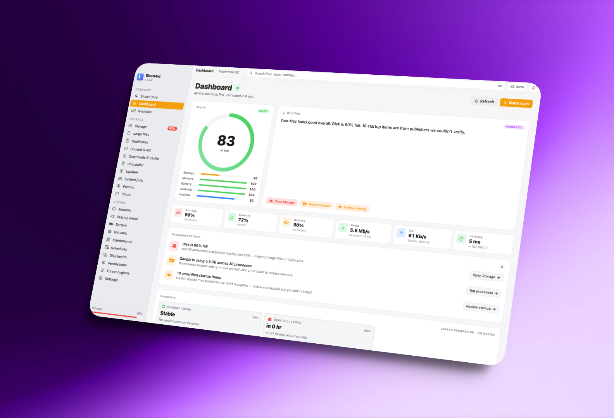
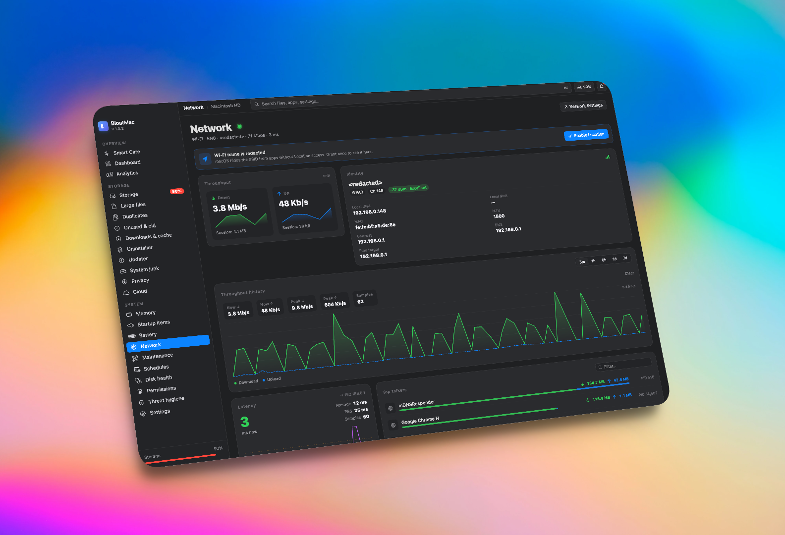
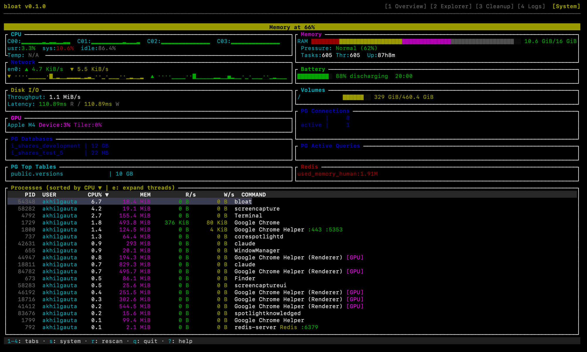

# bloat

> Your disk is bloated. Let's fix that.

Two ways to clean and monitor your Mac:

1. **BloatMac** — native SwiftUI desktop app. CleanMyMac-class feature surface, no subscription.
2. **bloat** — htop-style terminal UI. Disk analysis, smart cleanup, live system monitor, plugin system.

Both are real-detection tools — every module reads actual disk / system state, not mocks.

---

<p align="center">
  
</p>

# BloatMac — macOS app

Native SwiftUI cleanup + maintenance app. **19 screens.** CleanMyMac-class feature surface, no subscription.

**Storage**
- Smart Care · one-click scan + apply
- Storage treemap · Large files · Duplicates (exact + visually-similar via Vision)
- Unused & old · Downloads & cache
- Uninstaller (full leftover sweep) · Updater (Homebrew · MAS · Sparkle)
- System junk · Privacy · Cloud (iCloud · Drive · Dropbox · OneDrive)

**System**
- Memory · Startup items · Battery · Network
- Maintenance · Schedules · Disk health · Permissions audit
- Real `NSStatusItem` menu-bar widget — storage %, memory pressure, network rates, quick-scan

## Screenshots

**Dashboard**



**Network**



## Install BloatMac

```sh
brew install --cask akhil-gautam/tap/bloatmac
```

Or grab the `.dmg` from the [releases page](https://github.com/akhil-gautam/bloat/releases) (tags starting with `bloatmac-v…`).

Releases are **Developer ID signed and Apple-notarized** — Gatekeeper opens cleanly, no quarantine workaround.

Requires macOS 26 (Tahoe). The dashboard's AI briefing uses Foundation Models on macOS 26+ and falls back to a deterministic heuristic on older releases.

See [`bloatmac/README.md`](bloatmac/README.md) for the full module list, project layout, and roadmap.

---

# bloat (CLI)

An htop-style terminal UI for macOS that combines **disk storage analysis**, **smart cleanup**, and **real-time system monitoring** in one tool. Scan folders to find what's eating your disk, clean up caches/build artifacts/duplicates with tiered safety, and monitor CPU, memory, network, GPU, and processes — all without leaving the terminal.



Built in Rust with [ratatui](https://github.com/ratatui/ratatui).

## Install

### One-line install (recommended)

```bash
curl -fsSL https://raw.githubusercontent.com/akhil-gautam/bloat/main/install.sh | bash
```

Downloads the latest release binary for your Mac (Apple Silicon or Intel) and installs to `/usr/local/bin/`.

### From GitHub Releases

Download the latest binary from [Releases](https://github.com/akhil-gautam/bloat/releases):

| Platform | Download |
|----------|----------|
| macOS Universal (ARM64 + Intel) | `bloat-vX.Y.Z-macos-universal.tar.gz` |
| macOS Apple Silicon | `bloat-vX.Y.Z-macos-arm64.tar.gz` |
| macOS Intel | `bloat-vX.Y.Z-macos-x86_64.tar.gz` |

```bash
tar -xzf bloat-*.tar.gz
chmod +x bloat
sudo mv bloat /usr/local/bin/
```

### Build from source

```bash
git clone https://github.com/akhil-gautam/bloat.git
cd bloat
cargo build --release
./target/release/bloat
```

Requires Rust 1.70+ and macOS.

## Quick Start

```bash
bloat              # Launch interactive TUI
bloat scan ~/      # Quick scan summary
bloat top 10       # Top 10 largest items
bloat clean --dry-run  # Preview what can be cleaned
```

## Screens

### Folder Selection (startup)

On launch, pick which folders to scan:

```
bloat — your disk is bloated. let's fix that.
↑↓ navigate  Space select  Enter scan  a all  q quit  s system monitor
┌ Select folders to scan ────────────────────────┐
│  [ ] Desktop                                    │
│  [x] Downloads                                  │
│  [ ] Documents                                  │
│  [ ] Library                                    │
│  [ ] Applications                               │
│  [ ] Entire Home Directory                      │
└─────────────────────────────────────────────────┘
```

### Tab 1: Overview

Disk usage dashboard with segmented category bar, top space consumers (selectable + deletable), and reclaimable space summary.

- `j`/`k` — Navigate top consumers
- `Space` — Select items for deletion
- `d` — Delete selected (with confirmation dialog)

### Tab 2: Explorer

Interactive directory tree with proportional size bars.

- `j`/`k`/`↑`/`↓` — Navigate
- `Enter`/`→`/`l` — Expand directory
- `←`/`h` — Collapse directory

### Tab 3: Cleanup

Smart cleanup with 20+ detection rules, categorized by safety level. Split view with detail panel showing description, impact, and file paths.

- `j`/`k` — Navigate items
- `Space` — Toggle checkbox
- `a` — Select/deselect all
- `Enter` — Clean selected items

**Detection Rules:**

| Category | Rules | Safety |
|----------|-------|--------|
| Developer | `node_modules`, Xcode DerivedData, `cargo target/`, `.gradle`/`build`, Python `__pycache__`/`.venv`/`.tox`, CocoaPods cache, Swift `.build` | Safe - Caution |
| System | `~/Library/Caches`, old log files, Trash contents, iOS device backups, Time Machine snapshots | Safe - Caution |
| Applications | Browser caches (Chrome/Safari/Firefox/Arc), Slack/Discord/Teams, Spotify, Docker, Homebrew, npm/pip/cargo caches | Safe - Caution |
| Media | Duplicate files (BLAKE3 hash), large unused files (>1GB, 90+ days) | Caution - Risky |

**Safety Levels:**
- **Safe** (green) — Automatically moved to Trash. Caches, build artifacts — regenerated on next use.
- **Caution** (yellow) — Confirmation required, then moved to Trash. May cause slower rebuilds.
- **Risky** (red) — Confirmation required, choose Trash or permanent delete. Review carefully.

### Tab 4: Logs

Full deletion history with timestamps, file names, sizes, method (Trash/Permanent), and success/fail status.

### System Monitor (`s` key)

Full htop-style system monitor accessible from any screen via `s`. Press `Esc` to return.

```
┌ CPU ────────────────────────┐┌ Memory ─────────────────────┐
│ 0 ████░░░░ 23% 2.4GHz      ││ RAM ████████░░ 12/16 GiB    │
│ 1 ██░░░░░░ 12% 2.4GHz      ││  wired:2G active:6G compr:3G│
│ Hist: C0:▂▃▅▇ C1:▁▂▃▄      ││  Pressure: Normal (72%)     │
│ usr:12% sys:8% idle:80%     ││  Swp 0B/2G  Load 3.2 2.8    │
│ Temp: 52°C  3.5 GHz        ││  Tasks:551  Thr:2341         │
├ Network ────────────────────┤├ Battery ─────────────────────┤
│ en0: ▲ 1.2 MB/s ▼ 340 KB/s ││ ████████░░ 82% charging 1:22│
│ Chrome    ▲12M ▼89M → goog ││                              │
│ Slack     ▲1M  ▼4M  → amzn │├ Volumes ─────────────────────┤
├ Disk I/O ───────────────────┤│ / ████████░ 342/460 GiB     │
│ Throughput: 4.1 MiB/s       ││                              │
│ Latency: 0.12ms R / 0.08ms │├ Containers ──────────────────┤
├ GPU ────────────────────────┤│ postgres:15  running :5432   │
│ Apple M4 Device:13% Tiler:8%││ redis:7      running :6379   │
│ Renderer:12% Mem:420M/2.4G  ││                              │
└─────────────────────────────┘└──────────────────────────────┘
┌ Processes (sorted by CPU ▼ | e: expand threads) ───────────┐
│   PID  USER          CPU%        MEM  R/s     W/s  COMMAND │
│  1234  akhilgautam   45.1    1.2 GiB  2 MiB  1 MiB  node  │
│    ├── Thread 0x1a3   8.2%  running                        │
│    └── Thread 0x1a4   3.1%  sleeping                       │
│  5678  akhilgautam    2.1  120 MiB    0 B     0 B   ruby   │
│        [Ruby] Rails :3000                                   │
└─────────────────────────────────────────────────────────────┘
```

#### System Monitor Keybindings

| Key | Action |
|-----|--------|
| `c` | Sort by CPU% |
| `m` | Sort by Memory |
| `p` | Sort by PID |
| `n` | Sort by Name |
| `/` | Fuzzy search processes |
| `t` | Toggle tree view (parent → child hierarchy) |
| `g` | Cycle grouping: None → By App → By User |
| `e` | Expand/collapse process threads |
| `d` | Toggle process diff (new/exited/spikes in last 5s) |
| `K` | Kill selected process (with confirmation) |
| `Space` | Pause — enter history playback mode |
| `←`/`→` | Scrub through 5 minutes of history (when paused) |
| `Esc` | Exit filter / cancel / unpause / back |

#### What It Monitors

**CPU**
- Per-core usage bars with frequency (MHz)
- Per-core sparkline history (4 hottest cores)
- User / System / Idle breakdown
- Temperature + thermal throttle detection

**Memory**
- Segmented bar: wired (red), active (yellow), compressed (magenta), inactive (gray)
- Memory pressure indicator (Normal / Warning / Critical)
- Swap, load average, uptime, task & thread counts

**Network**
- Interface throughput with upload/download sparklines
- Per-app bandwidth, connections, and remote hosts
- Network anomaly detection (spike > 3x rolling average)

**Disk I/O**
- Live throughput (1-second samples via iostat)
- NVMe latency estimation (read/write)

**GPU** (Apple Silicon)
- Device / Tiler / Renderer utilization %
- GPU memory usage (in-use / allocated)
- `[GPU]` badge on GPU-using processes

**Battery** — charge %, charging/discharging, time remaining

**Volumes** — all mounted disks with usage bars

**Containers** — Docker containers with CPU/mem/ports, Kubernetes context

**Process Intelligence**
- Runtime detection: `[Node]` `[Python]` `[Ruby]` `[Java]` `[Go]` `[Rust]` `[Elixir]`
- Service labels: Rails, Sidekiq, Webpack, Vite, Gunicorn, Redis, PostgreSQL, Nginx
- Port mapping: `:3000` `:6379` `:5432`
- `[GPU]` badge for GPU-using processes
- Per-process disk read/write rates

**Smart Features**
- Threshold alerts (CPU > 90%, memory > 80% for 10s) with macOS desktop notifications
- Anomaly detection: CPU spikes (z-score > 2), memory jumps (> 500MB), new heavy processes, network spikes
- 5-minute history playback with anomaly markers on timeline

## CLI Commands

### `bloat` (default)

Launches the interactive TUI.

### `bloat scan [path]`

Scan and print a summary to stdout.

```bash
bloat scan ~/Downloads
bloat scan ~/Downloads --json    # Machine-readable output
bloat scan --path /tmp
```

### `bloat clean`

Clean detected junk.

```bash
bloat clean --dry-run            # Preview what would be cleaned
bloat clean --safe               # Auto-clean all Safe items, no prompts
bloat clean                      # Interactive cleanup with prompts
bloat clean --path ~/projects
```

### `bloat top [count]`

Show the N largest items.

```bash
bloat top                        # Top 10 (default)
bloat top 20                     # Top 20
bloat top 5 --path ~/Downloads
```

### Global Flags

| Flag | Description |
|------|-------------|
| `--json` | Machine-readable JSON output |
| `--no-color` | Disable colored output |
| `--path <dir>` | Override scan directory (default: `~`) |
| `--min-size <size>` | Hide items below threshold (e.g. `100MB`) |

## Full Keybinding Reference

Press `?` in the TUI to see this overlay:

```
── Global ──
q              Quit
?              Toggle this help
1 / 2 / 3 / 4 Switch tabs (Overview / Explorer / Cleanup / Logs)
Tab            Next tab
s              System monitor (htop)
r              Rescan filesystem
Esc            Cancel scan / back

── Overview (Tab 1) ──
j / k          Navigate top consumers
Space          Select item for deletion
d / Enter      Delete selected (with confirmation)

── Explorer (Tab 2) ──
j / k / ↑↓     Navigate tree
l / → / Enter  Expand directory
h / ←          Collapse directory

── Cleanup (Tab 3) ──
j / k          Navigate items
Space          Toggle item checkbox
a              Select / deselect all
Enter          Clean selected items

── System Monitor (s) ──
c / m / p / n  Sort by CPU / MEM / PID / Name
/              Fuzzy search processes
t              Toggle tree view (parent → child)
g              Cycle grouping (None → App → User)
e              Expand process threads
d              Toggle process diff (changes in 5s)
K (shift+k)    Kill selected process
Space          Pause / resume (enter playback)
← / →          Scrub history (when paused)
Esc            Exit filter / cancel / unpause
```

## Plugins

bloat has a three-layer plugin system — from zero-code config to full Lua scripting. Plugins add custom panels to the System Monitor tab.

### Layer 1: TOML Config (zero code)

Create `~/.config/bloat/plugins.toml`:

```toml
[[panel]]
name = "Redis"
command = "redis-cli info memory | grep used_memory_human"
interval = 5
position = "right"
color = "red"

[[panel]]
name = "Postgres"
command = "psql -c 'SELECT count(*) FROM pg_stat_activity;' -t 2>/dev/null || echo 'PG not running'"
interval = 10
position = "right"
color = "blue"

[[panel]]
name = "Ollama"
command = "curl -s localhost:11434/api/tags 2>/dev/null | python3 -c 'import sys,json; [print(m[\\"name\\"]) for m in json.load(sys.stdin).get(\\"models\\",[])]' || echo 'Ollama not running'"
interval = 30
position = "right"
color = "magenta"

[[panel]]
name = "Docker"
command = "docker ps --format '{{.Names}}\t{{.Status}}' 2>/dev/null | head -5 || echo 'Docker not running'"
interval = 10
position = "left"
color = "cyan"

[[panel]]
name = "Git"
command = "cd ~/projects && for d in */; do echo \\"$d$(cd $d && git status --short 2>/dev/null | wc -l | tr -d ' ')\\" changes\\\"; done | head -5"
interval = 30
position = "left"
color = "green"
```

| Field | Default | Description |
|-------|---------|-------------|
| `name` | required | Panel title |
| `command` | required | Shell command to run |
| `interval` | `5` | Refresh interval in seconds |
| `position` | `"right"` | `"left"` or `"right"` column |
| `color` | none | Border color: `red`, `green`, `blue`, `yellow`, `cyan`, `magenta` |

### Layer 2: External Process Protocol (any language)

Plugins are executables in `~/.config/bloat/plugins/` that communicate via JSON-lines over stdin/stdout.

**Protocol:**
```
bloat → plugin (stdin):  {"type":"tick","cpu_total":45.2,"mem_used":12884901888,"mem_total":17179869184,"processes":[...]}
plugin → bloat (stdout): {"type":"panel","title":"My Panel","rows":[{"text":"Line 1","color":"green"},{"text":"Line 2","bold":true}]}
```

**Example plugin** (`~/.config/bloat/plugins/redis-monitor`, make executable with `chmod +x`):

```bash
#!/bin/bash
while IFS= read -r line; do
    info=$(redis-cli info memory 2>/dev/null)
    if [ $? -eq 0 ]; then
        used=$(echo "$info" | grep "used_memory_human" | cut -d: -f2 | tr -d '\\r')
        echo "{\\"type\\":\\"panel\\",\\"title\\":\\"Redis\\",\\"rows\\\":[{\\"text\\":\\"Memory: $used\\",\\"color\\":\\"green\\"}]}\"
    else
        echo "{\\"type\\":\\"panel\\",\\"title\\":\\"Redis\\",\\"rows\\\":[{\\"text\\":\\"Not running\\",\\"color\\\":\\"red\\"}]}\"
    fi
done
```

Optional `manifest.toml` in the same directory for per-plugin config:

```toml
[redis-monitor]
interval = 5
position = "right"
```

### Layer 3: Lua Scripts (full logic)

Lua scripts in `~/.config/bloat/lua/*.lua` get system data and can do computation, filtering, and conditional logic.

```lua
-- ~/.config/bloat/lua/node_monitor.lua

panel = {
    name = "Node.js",
    interval = 3,
    position = "right",
    color = "green"
}

function collect(data)
    -- data.cpu_total, data.mem_used, data.mem_total
    -- data.processes = [{pid, name, cpu, mem}, ...]
    local lines = {}
    local count = 0
    local total_mem = 0

    for _, p in ipairs(data.processes) do
        if string.find(p.name:lower(), "node") then
            count = count + 1
            total_mem = total_mem + p.mem
        end
    end

    if count > 0 then
        table.insert(lines, {text = count .. " processes", color = "green"})
        table.insert(lines, {text = string.format("Mem: %.0f MiB", total_mem / 1048576), color = "cyan"})
    else
        table.insert(lines, {text = "No Node processes", color = "gray"})
    end

    return lines
end
```

**More examples:**

```lua
-- ~/.config/bloat/lua/heavy_hitters.lua
panel = { name = "Heavy Hitters", interval = 2, position = "left", color = "red" }

function collect(data)
    local lines = {}
    for _, p in ipairs(data.processes) do
        if p.cpu > 50 then
            table.insert(lines, {
                text = string.format("%s (PID %d): %.1f%%", p.name, p.pid, p.cpu),
                color = "red", bold = true
            })
        end
    end
    if #lines == 0 then
        table.insert(lines, {text = "All quiet", color = "green"})
    end
    return lines
end
```

### Plugin Ideas

| Use Case | Best Layer | Example |
|----------|-----------|---------|
| Redis queue depth | TOML | `redis-cli llen myqueue` |
| Postgres connections | TOML | `psql -c 'SELECT count(*) FROM pg_stat_activity' -t` |
| Sidekiq jobs | TOML | `curl -s localhost:3000/sidekiq/stats` |
| Ollama running models | TOML | `curl -s localhost:11434/api/tags \| jq` |
| Docker containers | TOML | `docker ps --format ...` |
| Node.js heap stats | External | Connect to `--inspect` debug port |
| Puma worker utilization | External | Parse puma stats endpoint |
| PyTorch VRAM | Lua | Filter processes, compute memory |
| ML inference tokens/sec | External | Poll ollama API, compute delta |
| Custom alerting | Lua | Conditional logic on system data |

### Real-World Example: Postgres Monitoring

Create `~/.config/bloat/plugins.toml` to monitor your database alongside system metrics:

```toml
# Connection states (active, idle, etc.)
[[panel]]
name = "PG Connections"
command = "psql -c \\"SELECT state, count(*) FROM pg_stat_activity GROUP BY state ORDER BY count DESC;\\" -t 2>/dev/null || echo 'PG not running'"
interval = 5
position = "right"
color = "blue"

# Currently running queries
[[panel]]
name = "PG Active Queries"
command = "psql -c \\"SELECT pid, now()-query_start as duration, left(query,50) FROM pg_stat_activity WHERE state='active' AND query NOT LIKE '%pg_stat%' ORDER BY duration DESC LIMIT 5;\\" -t 2>/dev/null || echo 'None'"
interval = 5
position = "right"
color = "blue"

# Database sizes
[[panel]]
name = "PG Databases"
command = "psql -c \\"SELECT datname, pg_size_pretty(pg_database_size(datname)) as size FROM pg_database WHERE datistemplate=false ORDER BY pg_database_size(datname) DESC LIMIT 8;\\" -t 2>/dev/null || echo 'PG not running'"
interval = 30
position = "left"
color = "blue"

# Largest tables in your app database
[[panel]]
name = "PG Top Tables"
command = "psql -d myapp_development -c \\"SELECT schemaname||'.'||relname, pg_size_pretty(pg_total_relation_size(relid)) FROM pg_catalog.pg_statio_user_tables ORDER BY pg_total_relation_size(relid) DESC LIMIT 5;\\" -t 2>/dev/null || echo 'No tables'"
interval = 30
position = "left"
color = "cyan"

# Redis alongside Postgres
[[panel]]
name = "Redis"
command = "redis-cli info memory 2>/dev/null | grep -E 'used_memory_human|connected_clients' || echo 'Redis not running'"
interval = 5
position = "right"
color = "red"
```

Replace `myapp_development` with your database name. Add `-U username -h hostname` to `psql` if needed.

See `examples/` directory for more ready-to-use plugin samples.

## Tech Stack

- **Language:** Rust
- **TUI:** [ratatui](https://github.com/ratatui/ratatui) + [crossterm](https://github.com/crossterm-rs/crossterm)
- **Filesystem:** [jwalk](https://github.com/Byron/jwalk) (parallel walker)
- **System info:** [sysinfo](https://github.com/GuillaumeGomez/sysinfo)
- **Hashing:** [BLAKE3](https://github.com/BLAKE3-team/BLAKE3) (duplicate detection)
- **Fuzzy search:** [fuzzy-matcher](https://github.com/lotabout/fuzzy-matcher) (skim algorithm)
- **Notifications:** [notify-rust](https://github.com/hoodie/notify-rust) (macOS Notification Center)
- **Trash:** [trash](https://github.com/Byron/trash-rs) (macOS Trash integration)
- **Lua scripting:** [mlua](https://github.com/mlua-rs/mlua) (Lua 5.4, vendored)
- **Config:** [toml](https://github.com/toml-rs/toml) (plugin config parsing)

## Architecture

```
src/
  main.rs             Entry point, CLI parsing (clap)
  app.rs              App state, event loop, key handlers
  tree.rs             In-memory filesystem tree
  scanner.rs          Parallel filesystem walker
  analyzer.rs         Runs cleanup rules against scan tree
  cleaner.rs          Deletion engine (trash / permanent)
  alerts.rs           Threshold alert engine + notifications
  history.rs          Time-series recording + anomaly detection
  system_monitor.rs   System stats collection (CPU/mem/net/GPU/disk)
  rules/
    mod.rs            CleanupRule trait + registry
    dev.rs            Developer tool rules
    system.rs         System cache/log rules
    apps.rs           Application cache rules
    media.rs          Duplicate/large file rules
  plugins/
    mod.rs            Plugin module registry
    config.rs         TOML config-driven panel loader
    runner.rs         Shell command panel executor
    protocol.rs       External process JSON-lines protocol
    lua_engine.rs     Lua scripting engine
  ui/
    mod.rs            Main draw + header + status bar + help overlay
    overview.rs       Tab 1: disk dashboard
    explorer.rs       Tab 2: directory tree
    cleanup.rs        Tab 3: smart cleanup
    logs.rs           Tab 4: deletion history
    htop.rs           System monitor (CPU/mem/net/GPU/processes)

~/.config/bloat/          User config directory
  plugins.toml            TOML panel definitions
  plugins/                External process plugins (executables)
    manifest.toml         Optional per-plugin config
  lua/                    Lua script plugins
    *.lua                 One file per panel
```

## License

MIT

---

## Cognitivebear smoke test

This PR was opened by Cognitivebear's local smoke test on 2026-05-25.
It validates the action agent end-to-end against a real repository
via OrbStack + Vertex AI Gemini.
